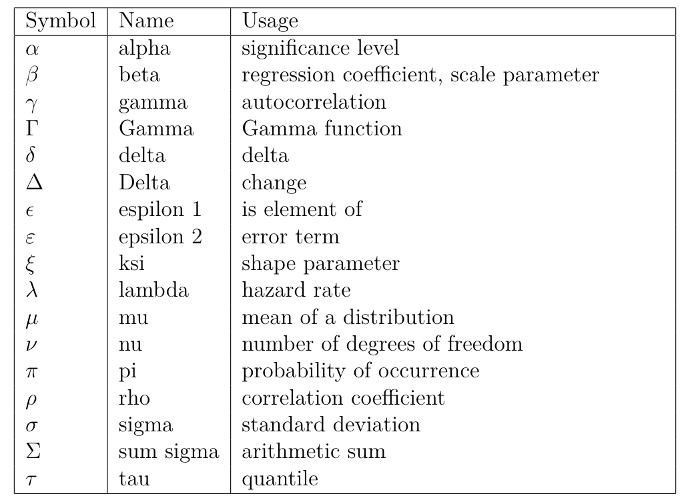

```{r setup, include=FALSE, comment=FALSE, message=FALSE}
knitr::opts_chunk$set(echo = TRUE, message = FALSE, warning = FALSE)
```


# Introduction to Financial Analytics

## Analytics

By its very nature the science of data analytics is disruptive. That means, among many other things, that much attention should be paid to the scale and range of invalid, as yet not understood, outlying, and emerging trends. This is as true within the finance domain of knowledge as any other.

Throughout the book, we will learn the core of ideas of programming osftware development to implement financial analyses (functions, objects, data structures, flow control, input and output, debugging, logical design and abstraction) through writing code. We will learn howt o setup stochastic simulations, manage data analyses, and employ numerical optimization algorithms, diagnose their limiations, and work with and filter large data sets. Since code is also an important form of communication among analyst, we will learn how to comment and organize code, as welll as document work product.

## Chapter Outline

Here is an outline of topics covered by chapter.

**2.  R Warm-Ups for Finance.** `R` computations, data structures, financial, probability and statistics calculations, visualization. Documentation with `R Markdown`


**3. More R Warm-Ups.** Functions, loops, control bootstrapping, simulations and more visualization.


**4. Stylized Facts of Financial Markets**. Data from FRED, Yahoo, and other sources. Empirical characteristics of economic and financial time series. Bootstrapping confidence intervals.

**5. Term Structure of Interest Rates.** Bond pricing, forward and yield curves. Estimating Non-linear regression splines. Applications.

**6. Market Risk.** Quantile (i.e., Value at Risk) and coherent (i.e., Expected Shortfall) risk measures

**7. Credit Risk.** Hazard rate models, Markov transition probabilities Risk measures, Laplace simulation with FFT.

**8. Operational Risk and Extreme Finance.** Generate frequency and severity of operational loss distribution. Estimating operational risk distribution parameters. Simulating loss distributions.

**9. Measuring Volatility.** Measuring volatility. GARCH estimation. GARCh simulation. Measuring Value at Risk (VaR) and Expected Shortfall (ES).

**10. Porfolio Optimization.** Combining risk management with portfolio allocations. Optimizing allocations. Simulating the effcient frontier.

**11. Aggregating Enterprise Risk.** Enterprise risk mangement analytics and applications. WOrkflow to build an online application. Introduction to `Shiny` and `ShinyDashboard`. Building a simple app. Using `R Markdown` and `Shiny`.


## Nomenclature

\\

# Macrofinancial Data Analysis


## Imagine This

Your US-based company just landed a contract worth more than 20 percent of your company's current revenue in Spain. Now that everyone has recovered from this coup, your management wants you to

1. Retreive and begin to analyze data about the Spanish economy

2. Compare the contrast Spanish stock market and goverment-issued debt value versus the United States and several other countries

3. Begin to generate economic scenarios based on political events that may, or may not, happen in Spain

Up to this point we had reviewed several ways to manipulate data in `R`. We then reviewed some basic finance and statistics concepts in `R`. We also got some idea of the financial analytics workflow.


1. What decision(s) are we making?
2. What are they key business questions we need to support this decision?
3. What data do we need?
4. What tools do we need to analyze the data?
5. How do we communicate answers to inform the decision?


### Working an example

Let's use this workflow to motivate our work in this chapter.

1. Let's identify a decision at work (e.g., investment in new machine, financing a building, acquisition of customers, hiring talent, locating manufacturing).

2. For this decision we will list three business questions you need to inform the decision we chose.

3. Now we consider data we might need to answer one of those questions and choose from this set: 
    
    * Macroeconomic data: GDP, inflation, wage, population
    
    * Financial data: stock market prices, bond prices, exchange rates, commodity prices
    
Here is the example using the scenario that started this chapter.

1. Out decision is **supply a new market segment**
    
    * Product: voltage devices with supporting software
    
    * Geography: Spain
    
    * Customers: Major buyers at Iberdrola, Repsol, and Endesa
    
2. We pose three business questions:
    
    * How would the performance of these companies affect the size and timing of orders?
    
    * How would the value of their product affect the value of our business with these companies?
    
    * We are a US funcitonal currency firm, so how would we manage the repatriation of accounts receivable from Spain?
    
3. Some data and analysis to inform the decision could include


    * Customer stock prices: volatility and correlation

    * Oil prices: volatility

    * USD/EUR exchange rates: volatility

    * All together: correlation among these indicators
    
### How will we proceed

This chapter will develop stylized facts of the market. These continue to be learned the hard Way: financial data is not independent, it possess volatile volatility, and has extreemes. 

    * Financial stock, bonds, commodity have highly interdependent relationships
    
    * Volatility is rarely constant and often has a structure (mean reversion) and is dependent on the past
    
    * Past shocks persist and may or may not dampen (rock in a pool).
    
    * Extreme events and likely to happen with other extreme events. 
    
    * Negative returns are more likely than positive returns (left skew).
    
## Building the Stylized Facts

Examples from the 70s, 80s, and 90s have multiple intersecting global events influencing decision makers. We will load some computational help and some data from Brent, format dates, and create a time series objext (package `zoo will be needed`)


```{r}
library(fBasics)
library(evir)
library(qrmdata)
library(zoo)
data("OIL_Brent")
str(OIL_Brent)
```

We will compute rates of change for Brent oil prices next.

```{r}
Brent.price <- as.zoo(OIL_Brent)
str(Brent.price)
```

```{r}
Brent.return <- diff(log(Brent.price))[-1] * 100
colnames(Brent.return) <- "Brent.return"
head(Brent.return, n = 5)
```

```{r}
tail(Brent.return , n = 5)
```

Let's look at this data with box plots and autocorrelation functions. Box plots will show minimum to maximum with the mean in the middle of the box. Autocorrelation plots will reveal how persistant the returns are over time


We run these statements.

```{r}
boxplot(as.vector(Brent.return), title = FALSE,
        main = "Brent Daily % Change", col = "blue",
        cex = 0.5, pch = 19)

skewness(Brent.return)
kurtosis(Brent.return)
```

This time series plot shows lots of return clustering and spikes, especially negative ones. Performing some "eyeball econometrics" these clusters seem to occur around - The oil embargo of the '70s - The height of the new interest rate regime in Paul Volcker at the Fed - "Black Monday" stock market crash in 1987 - Gulf I - Baring and other derivative business collapses in the 90s'

2. Let's look at the likelihood of a positive versus negative return. We might want to review the skewness and kurtosis definition and range to help us.

Now to look at persistance:

```{r}
acf(coredata(Brent.return), main = "Brent Daily Autocorrelogram",
      lag.max = 20, ylab = "", xlab = "",
      col = "blue", ci.col = "red")
```

```{r}
class(Brent.return)
```

```{r}
pacf(coredata(Brent.return), main = "Brent Daily Partial Autocorrelogram", 
     lag.max = 20, ylab = "", xlab = "",
     col = "blue", 
     ci.col = "red")
```

Cofidence interval are the red dashed lines. ACF at lag 6 means the correlation of currrent returns correlate with returns 6 trading days ago, including any correlation from trading day 1 to trading 6. PACF is simpler: it is the raw correlation between day 0 and day 6. ACF starts at lag 0 (today); PACF starts at lag 1 (yesterday).


Here is a first look:

```{r}
boxplot(as.vector(Brent.return), title = FALSE, 
        main = "Brent Daily Returns", col = "blue",
        cex = 0.5, pch = 10)
```

with some basic stats to back up the eyeball econometrics in the box plot

```{r}
skewness(Brent.return)
```

```{r}
kurtosis(Brent.return)
```

* A negative skew means there are more observations less than the median than greater.

* This high kurtosis means a pretty heavy tail, especially in negative returns. That means they have happened more often than positive returns.

* A preponderance of negative returns frequently happening spells trouble for anyone owning these assets.

### Implications

* We should recommend that management budget for the body of the distribution from the mean and out to postive levels.

* At the same time management should build a comprehensive playbook for the strong possibility that bad tail events frequently happen and might happen again (and why shouldn't they?)


3. Now for something really interesting

```{r}
acf(coredata(Brent.return), main = "Brent Autocorrelogram",
    lag.max = 20, ylab = "", xlab = "",
    col = "blue",
    ci.col = "red")
```

```{r}
pacf(coredata(Brent.return), 
     main = "Brent Partial Autocorrelogram",
     lag.max = 20,
     ylab = "",
     xlab = "",
     col = "blue",
     ci.col = "red"
     )
```

On average there are 5 days in the trading week and 20 in the trading month.

Some further thoughts:

* There seems to be positive weekly and negative monthly cycles.

* On a weeky basis negative rates (5 trading days ago) are followed by negative rates (today) and vice-versa with positive rates.

* On a monthly basis negative rates (20 days ago) are followed by positive rates (today).

* There is memory in the markets: positive correlation at least weekly up to a month ago reinforces the strong and frequently occuring negative rates (negative skew and leptokurtotic a.k.a heavy tails)

* Run the PACF for 60 days to see a 40-day negative correlation as well.

### Now for something really interesting..again


Let's look just at the size of the Brent returns. The absolute value of the returns (think of oil and countries entering and leaving the EU!) can signal contageion, herd mentality, and simply very large margin calls (and the collateral to back it all up!) Let's run this code:

```{r}
Brent.return.abs <- abs(Brent.return)
## Trading position size matters
Brent.return.tail <- tail(Brent.return.abs[order(Brent.return.abs)], 100)[1]
## Take just the first 100
## observations and pick the first

index <- which(Brent.return.abs > Brent.return.tail, 
                arr.ind = TRUE)
## Build an index of those sizes that 
## exceed the heavy tail threshold

Brent.return.abs.tail <- timeSeries(rep(0, length(Brent.return)),
                                    charvec = time(Brent.return))
# just a lot of zeros we will fill up
# next

Brent.return.abs.tail[index, 1] <- Brent.return.abs[index]
```

What did we do? Let's run some plots next.

```{r}
plot(Brent.return.abs, xlab = "", main = "Brent Daily Return Sizes", 
      col = "blue")
```

We see lots of return volatility - just in the pure size along. These are correlated with financial innovations from the 80s and 90s as well as Gulf 1, Gulf 2, Great Recession, and its 9/11 antecedents.

```{r}
acf(coredata(Brent.return.abs), main = "Brent Autocorrelogram",
    lag.max = 60, ylab = "", xlab = "",
    col = "blue", ci.col = "red")
```


```{r}
pacf(coredata(Brent.return.abs), main = "Brent Partial Autocorrelogram", lag.max = 60, ylab = "", xlab = "",
     col = "blue", ci.col = "red")
```

There is *Volatility Clustering galore*. Strong persistent lags of absolute movement in returns evidenced by the `ACF` plot.  There is evidence of dampenining with after shocks past trading 10 days ago. Monthly volatility affects today's performance.

Some of this volatility arises from the way Brent is traded. It is lifted through well-heads in the North Sea. It then is scheduled for loading onto ships and loads are then bid, along with routes to destination. It takes about five days to load crude and another five to unload. At each partial loading and unloading, the cruid is re-priced. Then there is the voyage loag itself, where paper claims to wet crude create further pricing and volatility.

Next we explore the relationship among financial variables.


## Gettings Caught in the Cross-Current

Now our job is to ask the really important questions around connectivity. Suppose we are banking our investment in certain sectors of an economy, with its GDP, financial capability, employment, exports and imports, and so on.


* How will we decide to contract for goods and services, segment vendors, segment customers, based on these interactions?


* How do we construct our portfolio of business opportunities?

* How do we indentify insurgent and relational risks and build a playbook to manage these?

* How will changes in one sector's factors (say, finance, political will) affect factors in another?


We will not stretch our univariate analysis a bit and look at *cross-correlations* to help us get the groun truth around these relationships, and *begin* to answer some of these business questions in a more specific contenxt.


Let's load the `zoo` and `qrmdata` libraries first and looka t the `EuroStoxx50` data set. Here we can imagine we are rebuilding our brand and footprint in the European Union and United Kingdom. Out customers might be the companies based in these countries as out target market.


* The data: 4 stock exchange indices across Europe (and the United Kingdom)

* This will allow us to profile the forward capabilities of these companies across their economies.

* Again we will look at returns data using the `diff(log(data))[-1]`

```{r}
library(zoo)
library(qrmdata)
library(xts)
data("EuStockMarkets")
EuStockMarkets.price <- as.zoo(EuStockMarkets)
EuStockMarkets.return <- diff(log(EuStockMarkets.price))[-1]* 100
```


```{r}
plot(EuStockMarkets.price, xlab = "", main = "")
```


```{r}
plot(EuStockMarkets.return, xlab = " ", main = " ")
```


Let's then look at cross-correlation among one pair of these indices to see how they are related across time (lags) for returns and the absolute value of returns. The function `ccf` will aid us tremendously.

```{r}
ccf(EuStockMarkets.return[,1], EuStockMarkets.return[,2],main ="Returns DAX vs. CAC",lag.max =20,ylab ="",xlab ="",col ="blue",ci.col ="red")
```

```{r}
ccf(abs(EuStockMarkets.return[,1]),abs(EuStockMarkets.return[,2]),main ="Absolute Returns DAX vs. CAC",lag.max =20,ylab ="",xlab ="",col ="blue",ci.col ="red")
```


We see some small raw correlations across time with raw retuns. More revealing, we see volatility of correlation clustering using return sizes. We can conduct one more experiment: a rolling correlation using this function:


```{r}
corr.rolling <-function(x) {
  dim <-ncol(x) 
  corr.r <-cor(x)[lower.tri(diag(dim),
                            diag =FALSE)]
  return(corr.r)
}
```

We then embed our rolling correlation function, `corr.rolling` into the function `rollapply`. The question we need to answer is: What is the history of correlations, and from the history, the pattern of correlation in the UK and EU stock markets? If there is a "history" with a "pattern", then we have to manage the risk that conducting business in one country will definately affect business in another. The implication is that bad things will be followed by more abd things more often than good things. The implication compounts a similar implication across markets.


```{r}
corr.returns <- rollapply(EuStockMarkets.return,
                          width = 250, 
                          corr.rolling,
                          align = "right",
                          by.column = FALSE)
colnames(corr.returns) <- c("DAX & CAC","DAX & SMI","DAX & FTSE"
                            ,"CAC & SMI","CAC & FTSE","SMI & FTSE")

plot(corr.returns, xlab = "", main = "")
```


